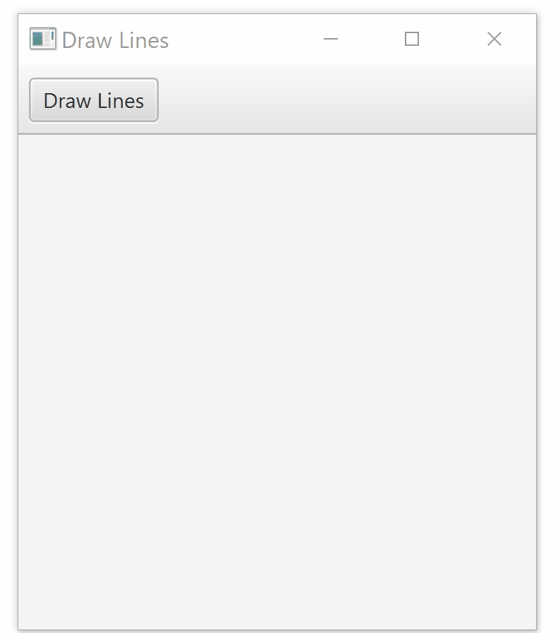

# Draw Stepped Lines - A basic JavaFX application



## Requirement

- Java Development Kit (JDK) download from [here](http://jdk.java.net/15/)
- JavaFX SDK, download from [here](https://gluonhq.com/products/javafx/)

## Running the program from Windows Powershell

1. Add an environment variable that points to the `lib` directory. This step is optional really but it is more convenient.

```powershell
$env:PATH_TO_FX="path-to-the-file"
```

example:

```powershell
$env:PATH_TO_FX="C:\Projects\javafx-sdk-11.0.2\lib"
```

This will store the value in `$env:PATH_TO_FX` temporarily. To store it permanently, store it in the `Environment Variables`. Detailed Tutorial is [here](https://www.baeldung.com/java-home-on-windows-7-8-10-mac-os-x-linux). Set the name `PATH_TO_FX` and value `path to the lib` instead of `JAVA_HOME` and its value.

2. Compile the application. First navigate to the folder containing `.fxml` and `.java` files from powershell.

```
javac --module-path $env:PATH_TO_FX --add-modules javafx.controls,javafx.fxml *.java
```

This runs all `.java` files in the directory.

3. Run the application

```powershell
java --module-path $env:PATH_TO_FX --add-modules javafx.controls,javafx.fxml DrawSteppedLines
```

More detailed tutorial is [here](https://openjfx.io/openjfx-docs/#install-javafx) on setting up and running JavaFX applcation.
